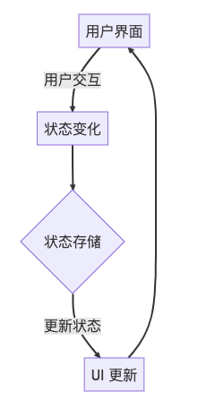
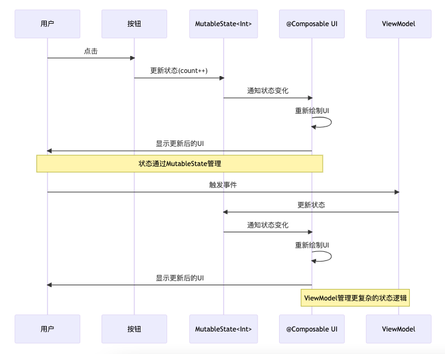

## 引言

本文介绍了 Android Compose 的基本概念，探讨其状态管理、列表处理以及性能优化的关键技术，帮助读者更好地理解和运用这一强大的 UI 框架。

## 一、Android Compose基本概念

### 1.1 什么是Android Compose?

Android Compose 是一个全新的、完全声明式的 Android UI 开发框架，它使得 UI 构建变得更简单、更直观。通过 Compose，开发者可以仅用少量的代码实现复杂的 UI 设计。

### 1.2 Compose的优势

- **声明式**: 直接描述 UI 应该呈现的样子，而不是一步步说明如何实现。
- **简洁性**: 减少模板代码，使得代码更加简洁易读。
- **可组合性**: 通过组合不同的组件来构建复杂的 UI。
- **工具支持**: 完美集成至 Android Studio，提供实时预览和代码完成等功能。

### 1.3 如何在项目中使用Compose

将 Compose 集成到现有项目中，或在新项目中使用它，只需在 Gradle 配置中添加依赖，并确保使用最新版本的 Android Studio，即可开始使用 Compose 构建 UI。

```kotlin
dependencies {
    implementation "androidx.compose.ui:ui:1.3.2"
    implementation "androidx.compose.material:material:1.3.2"
    implementation "androidx.compose.ui:ui-tooling-preview:1.3.2"
}
```

## 二、Compose中的状态管理

### 2.1 状态管理的重要性

在 Compose 中，状态管理是核心概念之一。正确的状态管理可以使应用更加稳定，并提高用户体验。

### 2.2 Compose中的状态和数据流

- **状态**: 是指任何可以决定或影响 UI 呈现的数据。例如，一个简单的计数器应用的状态可能是当前的计数值。
- **数据流**: 指的是状态数据如何在应用的不同部分之间流动和变化，以及这些变化如何反映到 UI 上。在响应式编程范式中，UI 组件会订阅这些状态变量，一旦状态变化，UI 组件会自动更新以反映新的状态。

为了更好地理解在 Compose 中状态和数据流的概念，以下是一个简单的计数器应用的状态和数据流示意图：



图解说明：

1. **用户界面** ：这是用户与应用交互的地方。例如，一个按钮用于增加计数。
2. **状态变化** ：当用户与界面交互（如点击按钮）时，会触发状态的变化。
3. **状态存储** ：状态在这里被存储和管理。在 Compose 中，这通常是通过 `MutableState` 或 `ViewModel` 来实现。
4. **UI 更新** ：一旦状态发生变化，与该状态相关的 UI 组件会自动更新以反映新的状态。

这个流程图展示了从用户交互到状态变化，再到 UI 更新的完整流程，清晰地描绘了数据如何在应用中流动。在响应式编程模型中，这种模式确保了 UI 的一致性和响应性，使得状态的任何变化都能即时反映在界面上。

### 2.3 使用State和MutableState处理状态

- `State` 和 `MutableState` 提供了一种在 Compose 中管理可变数据的方式，使得数据的任何更改都能实时反映在 UI 上。

```kotlin
@Composable
fun Counter() {
    var count by remember { mutableStateOf(0) }
    Button(onClick = { count++ }) {
        Text("Clicked $count times")
    }
}
```

### 2.4 通过ViewModel进行状态管理

ViewModel 用于在 Compose 中管理界面相关的数据状态，它可以帮助实现状态的持久化，使状态管理更加清晰和模块化。

下图描述了Compose中状态管理的调用时序图：


这个时序图展示了两种状态管理的情况：

1. 直接使用 `MutableState` ：用户通过UI（如按钮）触发状态变化， `MutableState` 更新并通知 `@Composable` 函数，导致UI重新绘制。
2. 通过 `ViewModel` 管理状态：更复杂的状态逻辑可以通过 `ViewModel` 来管理，它同样更新 `MutableState` ，并通过相同的机制触发UI更新。

这种方式清晰地展示了状态如何在用户操作和UI更新之间流转，以及 `ViewModel` 如何被集成到这一流程中，提供更持久和模块化的状态管理。

### 2.5 通过 ViewModel 进行状态管理的代码示例

假设我们有一个用户界面，显示一个用户的个人资料和他们的帖子列表。我们将使用 ViewModel 来管理用户的个人资料信息和帖子列表，以确保这些数据在配置更改（如设备旋转）时仍然保持不变，并且使得数据处理逻辑与 UI 逻辑分离，增强代码的可维护性。

首先，我们定义一个 ViewModel：

```kotlin
class UserProfileViewModel : ViewModel() {
    // LiveData持有用户信息
    private val _userInfo = MutableLiveData<User>()
    val userInfo: LiveData<User> = _userInfo

    // LiveData持有用户帖子列表
    private val _posts = MutableLiveData<List<Post>>()
    val posts: LiveData<List<Post>> = _posts

    // 模拟加载用户信息
    fun loadUserInfo(userId: String) {
        viewModelScope.launch {
            _userInfo.value = repository.getUserInfo(userId)
        }
    }

    // 模拟加载帖子
    fun loadPosts(userId: String) {
        viewModelScope.launch {
            _posts.value = repository.getUserPosts(userId)
        }
    }
}
```

接下来，在 Composable 函数中使用这个 ViewModel：

```kotlin
@Composable
fun UserProfileScreen(viewModel: UserProfileViewModel) {
    // 订阅ViewModel中的LiveData
    val userInfo by viewModel.userInfo.observeAsState()
    val posts by viewModel.posts.observeAsState()

    Column {
        userInfo?.let {
            Text("Name: ${it.name}")
            Text("Email: ${it.email}")
        }
        posts?.let {
            LazyColumn {
                items(it) { post ->
                    Text(post.title)
                }
            }
        }
    }
}
```

在这个例子中， `UserProfileViewModel` 管理着用户信息和帖子列表的状态。这些状态通过 `LiveData` 对象暴露给 UI 层，而 Composable 函数通过 `observeAsState()` 方法订阅这些 LiveData 对象。

当 ViewModel 更新这些 LiveData 对象的值时，与之相关的 UI 自动更新，反映出最新的状态。这样的设计不仅使状态管理更加模块化和清晰，还利用了 LiveData 的生命周期感知能力，确保 UI 组件在合适的时间订阅或取消订阅数据，避免内存泄漏。

通过这种方式，ViewModel 成为了状态和数据流的中心管理点，使得状态的管理更加可预测和可控，同时也简化了 UI 组件的逻辑，使其更加专注于呈现。

## 三、Compose中的列表和滚动

### 3.1 列表和滚动的基本概念

在移动应用中，列表是展示重复数据的常用方式。Compose 通过 `LazyColumn` 和 `LazyRow` 提供了高效的列表实现。

### 3.2 使用LazyColumn和LazyRow实现高效列表

这些组件只渲染可视区域内的元素，从而优化性能和响应速度。

```kotlin
@Composable
fun MessageList(messages: List<String>) {
    LazyColumn {
        items(messages) { message ->
            Text(text = message)
        }
    }
}
```

### 3.3 如何自定义列表项

可以通过定义不同的 Composable 函数来创建自定义的列表项，实现个性化的 UI。

要自定义列表项，你可以创建一个单独的 `@Composable` 函数，这个函数定义了列表项的外观和行为。这种方法不仅使代码更加模块化，还可以根据需要轻松地重用和调整这些自定义组件。

下面代码展示了如何自定义列表项来显示消息，其中每个消息项包括消息文本和一个时间戳：

```kotlin
@Composable
fun MessageList(messages: List<Message>) {
    LazyColumn {
        items(messages) { message ->
            MessageItem(message)
        }
    }
}

@Composable
fun MessageItem(message: Message) {
    Row(verticalAlignment = Alignment.CenterVertically, modifier = Modifier.padding(8.dp)) {
        Column(modifier = Modifier.weight(1f)) {
            Text(text = message.content, style = MaterialTheme.typography.body1)
            Text(text = "Sent at ${message.timestamp}", style = MaterialTheme.typography.caption)
        }
        IconButton(onClick = { /* handle delete or other actions */ }) {
            Icon(Icons.Default.Delete, contentDescription = "Delete message")
        }
    }
}

data class Message(val content: String, val timestamp: String)
```

在这个例子中：

- `MessageList` 函数使用 `LazyColumn` 来渲染一个消息列表。每个列表项都是通过调用 `MessageItem` 函数来创建的。
- `MessageItem` 函数定义了每个列表项的布局，这里使用了 `Row` 和 `Column` 来组织文本和按钮。这使得每个列表项包含了消息内容、时间戳和一个删除按钮。
- `Message` 是一个数据类，包含了消息的内容和时间戳。

### 3.4 处理列表中的状态和事件

在列表的 Composable 中处理用户交互和数据变更，确保列表的响应性和更新效率。这通常涉及到对列表数据的操作，如添加、删除或修改列表项，以及响应用户的交互事件。下面，我们将通过一个具体的例子来展示如何在 Compose 中处理列表中的状态和事件。

#### 示例：处理列表中的删除事件

假设我们有一个消息列表，每个消息旁边都有一个删除按钮。当用户点击删除按钮时，我们需要从列表中移除相应的消息。这涉及到状态的更新和事件的处理。

首先，我们定义一个 ViewModel 来管理消息列表的状态：

```kotlin
class MessageViewModel : ViewModel() {
    private val _messages = MutableLiveData<List<Message>>(listOf())
    val messages: LiveData<List<Message>> = _messages

    fun deleteMessage(message: Message) {
        _messages.value = _messages.value?.filter { it != message }
    }
}
```

在这个 ViewModel 中，我们使用 `MutableLiveData` 来存储消息列表，并提供一个 `deleteMessage` 方法来处理删除操作。

接下来，我们定义 Composable 函数来显示消息列表和处理删除事件：

```kotlin
@Composable
fun MessageListScreen(viewModel: MessageViewModel) {
    val messages by viewModel.messages.observeAsState(initial = emptyList())

    LazyColumn {
        items(messages) { message ->
            MessageItem(message, onDelete = { viewModel.deleteMessage(message) })
        }
    }
}

@Composable
fun MessageItem(message: Message, onDelete: () -> Unit) {
    Row(verticalAlignment = Alignment.CenterVertically, modifier = Modifier.padding(8.dp)) {
        Column(modifier = Modifier.weight(1f)) {
            Text(text = message.content, style = MaterialTheme.typography.body1)
            Text(text = "Sent at ${message.timestamp}", style = MaterialTheme.typography.caption)
        }
        IconButton(onClick = onDelete) {
            Icon(Icons.Default.Delete, contentDescription = "Delete message")
        }
    }
}
```

在这个例子中：

- `MessageListScreen` 函数订阅 ViewModel 中的 `messages` LiveData，并使用 `LazyColumn` 来渲染消息列表。每个消息项都是通过调用 `MessageItem` 函数来创建的，其中包括一个删除按钮的处理逻辑。
- `MessageItem` 函数接收一个 `onDelete` 函数作为参数，这个函数在删除按钮被点击时调用。这样，删除逻辑被封装在 ViewModel 中，而 UI 只负责调用这个逻辑。

通过这种方式，我们将状态管理（在 ViewModel 中）和 UI 呈现（在 Composable 函数中）分离开来，使得代码更加清晰和易于维护。同时，这也使得对列表中的数据进行操作时，UI 可以自动更新以反映最新的状态，确保应用的响应性和用户体验。

## 四、Compose性能优化

性能是提供流畅用户体验的关键。在 Compose 中，由于其声明式和高度动态的特性，性能优化尤为重要，以确保应用的响应速度和流畅度。

### 4.1 避免不必要的重绘

在 Compose 中，避免不必要的 UI 重绘是提升性能的关键策略。通过合理使用状态和记忆化技术，如 `remember` 和 `derivedStateOf` ，可以显著减少组件的重组次数。这不仅减少了CPU的负担，还能避免频繁的界面闪烁，提升用户体验。例如，通过将计算密集型结果或复杂的业务逻辑缓存，只在相关依赖发生变化时才重新计算，从而减少了组件的不必要更新。

### 4.2 使用remember和derivedStateOf优化状态

在 Compose 中， `remember` 和 `derivedStateOf` 是两个非常有用的函数，它们用于优化状态管理和性能。下面是它们各自的作用和如何协同工作。

#### 4.2.1 remember

`remember` 函数用于在重组过程中保持状态。当一个 `@Composable` 函数被重新调用（重组）时，通常其内部的所有变量都会被重新初始化。使用 `remember` 可以避免这种情况，它会记住给定的值，并在重组时保持不变，除非其依赖的状态发生变化。

**作用**:

- **保持状态**: 在 Composable 函数的多次重组中保持数据状态不变。
- **性能优化**: 避免不必要的计算，因为记住的值只在必要时（依赖的状态变化时）更新。

#### 4.2.2 derivedStateOf

`derivedStateOf` 是一个专门用于创建派生状态的函数。派生状态是基于其他状态计算得出的状态。使用 `derivedStateOf` 可以确保派生值仅在其依赖的状态改变时重新计算，这有助于避免不必要的计算和重组。

**作用**:

- **减少计算**: 只在依赖的状态变化时重新计算派生状态。
- **保持一致性**: 确保派生状态的值在一个重组周期内保持一致，即使依赖的状态在同一周期内多次变化。

#### 4.2.3 结合使用

将 `remember` 和 `derivedStateOf` 结合使用可以进一步优化性能。通过 `remember` 记住 `derivedStateOf` 的结果，可以确保派生状态的计算结果在重组期间保持不变，除非其依赖的状态发生变化。

```kotlin
@Composable
fun OptimizedDisplay(count: Int) {
    val message = remember(count) {
        derivedStateOf {
            "The count is $count"
        }
    }

    Text(text = message.value)
}
```

在这个例子中， `message` 是一个派生状态，它依赖于外部传入的 `count` 。使用 `remember` 和 `derivedStateOf` 的组合确保只有当 `count` 改变时，字符串才会重新计算，并且在重组期间保持不变。

这种模式在处理复杂状态和性能关键的应用中非常有用，可以显著减少不必要的计算和提高应用的响应速度。

### 4.3 列表性能优化技巧

在处理长列表和滚动视图时，性能优化尤为关键。 Compose 提供了 `LazyColumn` 和 `LazyRow` 等组件，这些组件只渲染可视区域内的元素，从而优化性能和响应速度。然而，即使使用这些懒加载组件，开发者仍需注意以下几点以进一步提升列表性能：

1. **合理使用键值对（Keys）** ：在 `items` 函数中使用 `key` 参数可以帮助 Compose 更有效地识别和重用元素。这是因为当列表更新时，Compose 可以通过键值对来确定哪些元素是新的、哪些元素被移除，从而减少不必要的重绘和重新布局。
   ```kotlin
   @Composable
   fun MessageList(messages: List<Message>) {
       LazyColumn {
           items(messages, key = { message -> message.id }) { message ->
               Text(text = message.content)
           }
       }
   }
   ```
2. **避免复杂的子组件** ：尽量简化列表每一项的布局。复杂的布局会增加渲染时间，尤其是在滚动时。如果列表项布局复杂，考虑将其拆分为更小的、更简单的组件，或者使用 `remember` 和 `derivedStateOf` 来缓存复杂的计算结果。
3. **条件渲染优化** ：对于条件渲染的内容，使用 `LazyColumn` 的 `item` 方法来单独处理，而不是在 `items` 方法中处理整个列表。这样可以避免在每次重组时对整个列表进行计算，而只关注变化的部分。
4. **预加载和分页加载** ：对于数据量大的列表，考虑实现预加载或分页加载机制，以减少一次性加载的数据量，从而减轻内存压力并提升响应速度。这可以通过监听滚动位置并在接近列表底部时加载更多数据来实现。
5. **使用合适的数据结构** ：确保后端数据结构和前端渲染结构的匹配性。不合理的数据结构可能导致频繁的状态更新和重组，影响性能。

通过这些策略，可以显著提高长列表的性能，确保应用即使在数据量大或设备性能有限的情况下也能保持流畅的用户体验。

## 五、Compose 最佳实践详解与代码示例

实际使用中，我们还会遇到很多性能问题。比如在使用 Compose 的 `LazyVerticalGrid` 构建复杂多布局列表时，可能会由于滑动过程中的频繁重组，导致滑动不流畅。

通过下面的代码示例和解释，我们可以更好地理解如何在实际的 Compose 应用中应用这些最佳实践，以提高应用的性能和响应速度。

### 5.1 优化重组次数

使用 `LaunchedEffect` 或 `remember` 来缓存数据，避免不必要的重组。例如，如果你有一个需要从网络加载的数据列表，可以使用 `LaunchedEffect` 来确保只在必要时加载数据：

```kotlin
@Composable
fun DataList() {
    var dataList by remember { mutableStateOf(listOf<String>()) }
    LaunchedEffect(Unit) {
        dataList = fetchDataFromNetwork()
    }

    LazyColumn {
        items(dataList) { data ->
            Text(text = data)
        }
    }
}
```

在这个例子中， `LaunchedEffect` 用于加载数据，并且只在组件首次加载时触发，避免了因为父组件的重组而导致的不必要的网络请求。

### 5.2 使用稳定的数据类型

确保列表中的每个元素都有一个稳定的标识符。这可以通过在 `items` 函数中使用 `key` 参数来实现：

```kotlin
@Composable
fun MessageList(messages: List<Message>) {
    LazyColumn {
        items(messages, key = { message -> message.id }) { message ->
            Text(text = message.content)
        }
    }
}
```

在这个例子中，每个消息都有一个唯一的 `id` ，这个 `id` 被用作 `key` 参数，帮助 Compose 追踪和维护每个列表项的状态，从而优化性能。

### 5.3 使用缓存机制

对于复杂的数据，使用 `remember` 来缓存计算结果，避免每次重组时重新计算：

```kotlin
@Composable
fun ExpensiveView(data: Data) {
    val expensiveResult = remember(data) {
        calculateExpensiveResult(data)
    }

    Text("Result: $expensiveResult")
}
```

这里， `calculateExpensiveResult` 是一个耗时的计算函数，通过 `remember` 使用数据 `data` 作为键，只有当 `data` 改变时才重新计算。

### 5.4 性能测试与优化

在开发过程中，使用 Android Studio 的 Profiler 工具来监控应用的 CPU 和内存使用情况，确保没有性能瓶颈。

### 5.5 关注框架更新

保持对 Compose 更新的关注，并及时更新到最新版本以利用性能改进。例如，检查项目的 `build.gradle` 文件，确保使用最新的 Compose 依赖。

### 5.6 使用副作用函数正确处理状态和副作用

使用 `derivedStateOf` 来创建依赖于其他状态的派生状态，这有助于减少不必要的计算：

```kotlin
@Composable
fun UserDisplay(user: User) {
    val displayName = remember(user) {
        derivedStateOf {
            "${user.firstName} ${user.lastName}"
        }
    }

    Text("Hello, ${displayName.value}!")
}
```

在这个例子中， `displayName` 是一个派生状态，它只在 `user` 对象改变时重新计算。

## 六、结论

Android Compose 提供了一种现代化、高效且直观的方式来构建 Android 应用的用户界面。通过其声明式的编程范式，Compose 不仅简化了 UI 开发流程，还通过强大的状态管理和性能优化功能，确保了应用的响应性和流畅性。

**Compose的优势和功能总结**

- **声明式 UI**: Compose 允许开发者描述他们想要的 UI，而不是如何达到这个目的，这简化了代码并减少了出错的可能。
- **组件化**: 通过可重用的组件，Compose 使得 UI 设计更加模块化，易于测试和维护。
- **集成工具**: Android Studio 集成提供了无缝的开发体验，包括实时预览和代码自动完成。
- **性能优化**: Compose 内置了多种性能优化技术，如记忆化和懒加载，确保即使是数据密集型的应用也能保持流畅。

